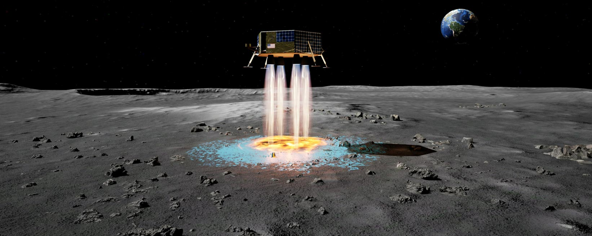
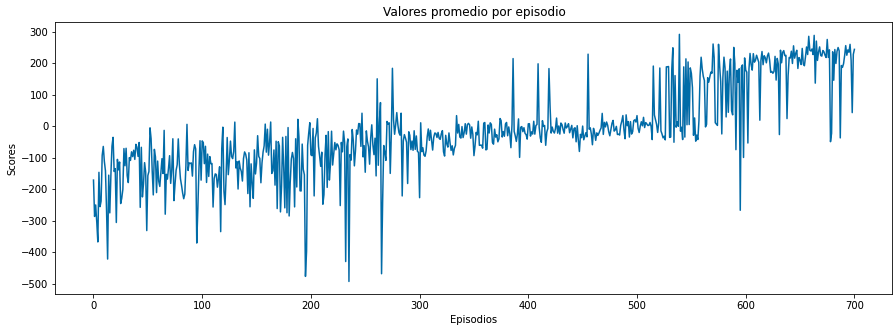
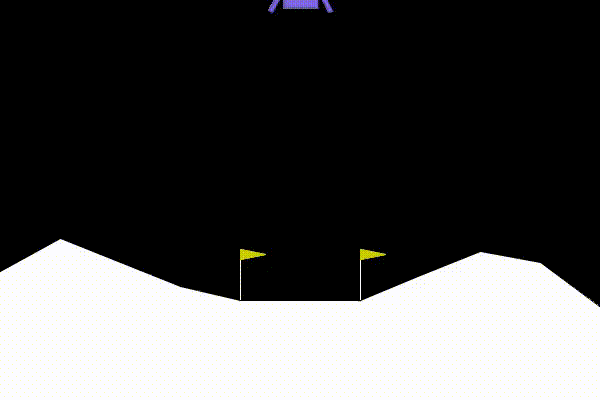

# RL-Pytorch-LunarLander
Practica de Reinforcement Learning with Pytorch

**Master Inteligencia Artificial y Avanzada - Universidad de Valencia**

**Nombre: Mauricio Arancibia**

## Lunar Lander
El entorno Lunar Lander ([OpenGym](https://www.gymlibrary.ml/environments/box2d/lunar_lander/)) es un problema clásico de optimización de la trayectoria de un cohete. De acuerdo con el principio máximo de Pontryagin, lo óptimo es encender el motor a toda velocidad o apagarlo. Esta es la razón por la que este entorno tiene acciones discretas: encendido o apagado del motor.

Hay dos versiones de entorno: discreto o continuo. La plataforma de aterrizaje siempre está en las coordenadas (0,0). Las coordenadas son los dos primeros números en el vector de estado. Es posible aterrizar fuera de la plataforma de aterrizaje. El combustible es infinito, por lo que un agente puede aprender a volar y luego aterrizar en su primer intento.

### Espacio de acción (4)

Hay cuatro acciones discretas disponibles: no hacer nada, disparar el motor de orientación izquierda, disparar el motor principal, disparar el motor de orientación derecha.

### Espacio de observación

Hay 8 estados: las coordenadas del módulo de aterrizaje en x e y, sus velocidades lineales en x e y, su ángulo, su velocidad angular y dos valores booleanos que representan si cada pierna está en contacto con el suelo o no.

### Recompensas

La recompensa por moverse desde la parte superior de la pantalla hasta la plataforma de aterrizaje y detenerse es de aproximadamente 100-140 puntos. Si el módulo de aterrizaje se aleja de la plataforma de aterrizaje, pierde la recompensa. Si el módulo de aterrizaje se estrella, recibe -100 puntos adicionales. Si llega a descansar, recibe +100 puntos adicionales. Cada pierna con contacto con el suelo es +10 puntos. Disparar el motor principal es -0.3 puntos cada cuadro. Disparar el motor lateral es -0.03 puntos cada fotograma. El problema se resuelve al alcanzar los 200 puntos.

### Estado inicial

El módulo de aterrizaje comienza en el centro superior de la ventana gráfica con una fuerza inicial aleatoria aplicada a su centro de masa.

### Terminación del episodio

El episodio termina si:

- el módulo de aterrizaje se estrella (el cuerpo del módulo de aterrizaje entra en contacto con la luna);

- el módulo de aterrizaje sale de la ventana gráfica (la coordenada x es mayor que 1);

- el módulo de aterrizaje no está despierto. De los documentos de Box2D, un cuerpo que no está despierto es un cuerpo que no se mueve y no choca con ningún otro cuerpo:

>Cuando Box2D determina que un cuerpo (o grupo de cuerpos) se ha detenido, el cuerpo entra en un estado de suspensión que tiene muy poca sobrecarga de CPU. Si un cuerpo está despierto y choca con un cuerpo dormido, entonces el cuerpo dormido se despierta. Los cuerpos también se despertarán si se destruye una articulación o un contacto adherido a ellos.

## Explicacion Grafica del problema Lunar Lander

Como puede ver en la imagen a continuación, hay una nave espacial. La tarea es aterrizar la nave espacial entre las banderas sin problemas. La nave tiene 3 aceleradores en él. Un acelerador apunta hacia abajo y los otros 2 puntos en la dirección izquierda y derecha. Con la ayuda de estos, tenemos que controlar el Barco.

Hay 2 entornos de aterrizaje lunar diferentes en OpenAIGym. Uno tiene espacio de acción discreto y el otro tiene espacio de acción continuo. Para esta practica vamos utilizar el espacio Discreto.

## Resolviendo el entorno

Para la practica vamos a resolver el problema utilizando un algoritmo DQN, el cual es compatible y trabaja bien para espacios de accion tanto discretos como continuos.

Tambien utilizamo una politica "Actor Critic".

## Resultados

El problema converge en el episodio 601, con un valor promedio 200.35 puntos. En la siguiente gráfica podemos observar el comportamiento de los episodios y los valores promedio obtenidos hasta alcanzar el objetio de los 200 puntos.

## Video Test

